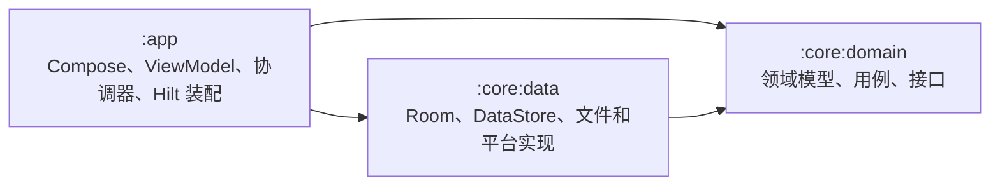

# 条码生成器 Beta

Android 条码生成器的 Beta 测试版本，用于验证新功能、现代化 Android 架构迁移和交互动画。

> 当前 Beta 版本：`1.0.57`<br>
> 当前分支：`beta`<br>
> 测试包名：`com.luckyalanzhou.barcodegenerator.test`<br>
> 稳定性说明：测试版，不建议作为唯一的生产环境应用使用。

## 当前 Beta 状态

- 已完成 Compose 主界面迁移，使用四个底部 Tab：生成、历史、收藏、设置。
- 底部 Tab 使用液态玻璃选中框，支持跟随手指滑动、触碰放大和弹簧回弹动画。
- 选中框当前高度为 `56dp`；图标和文字在动画结束后恢复原始尺寸。
- 增加 Beta 测试中心、调试日志导出和 Beta 专用诊断能力。
- Beta 使用独立 applicationId，应用数据和入口均独立于其他版本。

## 功能

- 生成 Code 128-B、QR Code、Code 39、EAN-13、EAN-8、UPC-A、ITF-14 和 Codabar。
- 支持一次输入多行内容并批量生成条码。
- 支持相机/图片识别文字和条码内容。
- 查看生成历史，重新生成、复制、分享和删除条码。
- 收藏条码，使用文件夹整理、重命名、移动和删除收藏内容。
- 收藏数据备份与恢复。
- 通过局域网在手机和浏览器之间分享条码和文件。
- 支持浅色/深色主题、条码结果页亮屏和应用内更新检查。

## 下载 Beta

最新 Beta Release：

<https://github.com/luckyalanzhou/Barcode-generator-for-Android/releases/tag/android-test-v1.0.57>

APK 文件名：`BarcodeGeneratorTest1.0.57.apk`

```text
应用包名：com.luckyalanzhou.barcodegenerator.test
```

## 项目结构

```text
android/
├─ app/             # Android 应用、Compose 界面、ViewModel、协调器和依赖装配
│  └─ src/main/java/com/luckyalanzhou/barcodegenerator/
│     ├─ presentation/ # 页面状态、ViewModel 和业务流程协调
│     ├─ ui/           # Compose 页面、组件、主题和系统能力桥接
│     └─ di/           # Hilt 依赖绑定
└─ core/
   ├─ domain/       # Kotlin/JVM 领域模型、校验、用例和接口
   └─ data/         # Room、DataStore、文件、网络及 Android 平台接口实现
```

### 模块依赖



`:core:domain` 不依赖 Android；`:core:data` 依赖领域接口并提供实现；`:app` 负责展示、流程协调和依赖装配。当前共享 Compose UI 位于 `:app`，没有单独的 `:core:ui` 模块。

### 条码生成流程

1. Compose 生成页面将输入草稿和格式交给 `GenerateViewModel`。
2. `BarcodeViewModel` 通过 `GenerateCoordinator` 调用 `GenerateBarcodesUseCase`，验证输入并产生领域模型。
3. 持久化协调器调用 `BarcodeRepository`；`:core:data` 中的 Room 实现负责保存历史和收藏数据。
4. ViewModel 发布结果状态并切换到结果页，Compose 加载或生成条码图像后显示。

## 测试说明

- Beta 用于新功能、架构迁移、动画调整和兼容性验证。
- 测试反馈请附上 Beta 版本号、Android 版本、设备型号和复现步骤。
